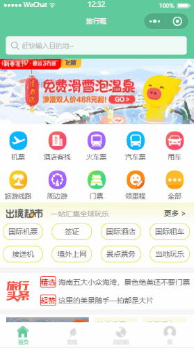
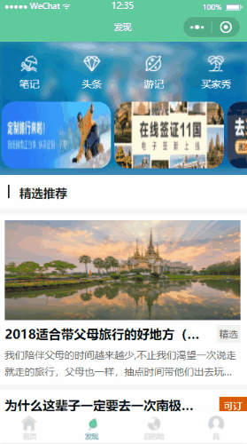
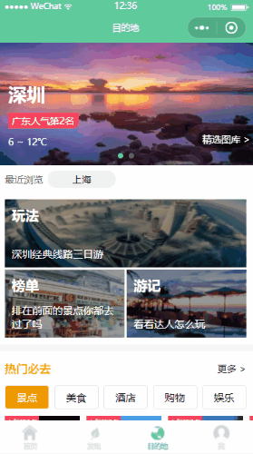
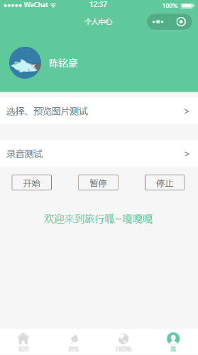
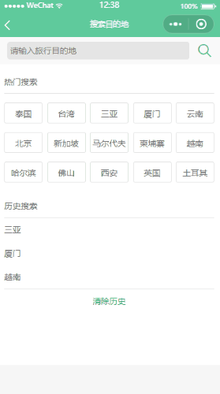

# Challenge-Cup_2025
2025年人工智能挑战智慧文旅
### 小组成员：

刘卓昕
陈彦君
张洲耒
吕博文
彭晓纯
陈槿千
======

#### 开发准备：
##### 小程序开发管理权限：张洲耒 刘卓昕 小程序体验权限：彭晓纯
1、https://developers.weixin.qq.com/miniprogram/dev/devtools/ext.html 下载微信开发者工具（也可在vscode里自己弄微信小程序模拟器，有点麻烦）

2、APPID：wx6b3c93505c5f4d2c

# 旅游类微信小程序demo

一个旅游类型的小程序，主要用于熟悉小程序Api

## 项目截图

首页

发现页

地点页

个人页

搜索页

